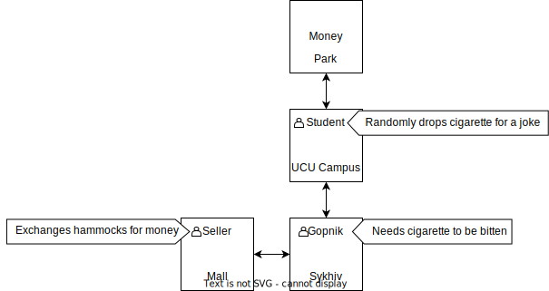

# The wandering_game

The game is run in cmd. To start the game, run my_main.py using the command below.
```
python my_main.py
```

The game starts in UCU campus. The information about location is printed to cmd.
The description looks like this
```
UCU Campus
--------------------
A great teritory where you can forget about social life
The Stryiskyi Park is north
The Sykhiv is south
Serhii is here!
APPS UCU student. Likes jokes
```

You can move using
```
north
south
east
west
```

For better understanding of the game, here's a map


To interact with characters you can use the command
```
interact
```

To take items use command
```
take
```

The game ends as you buy hammock from the seller and get to the park
